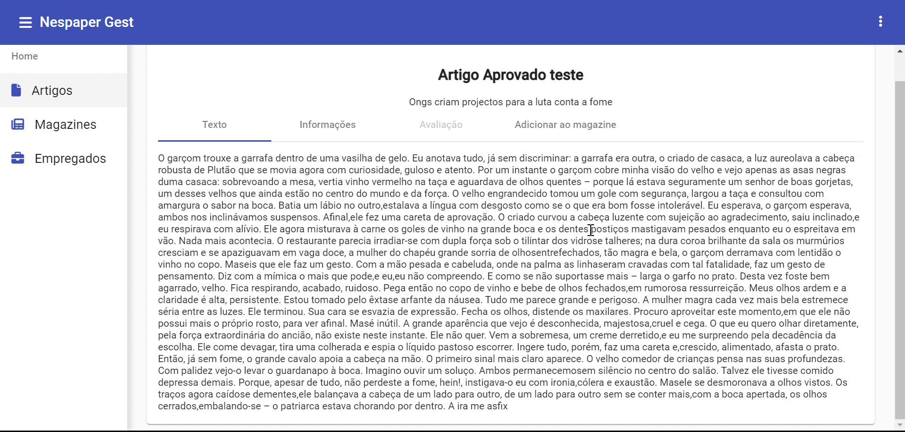
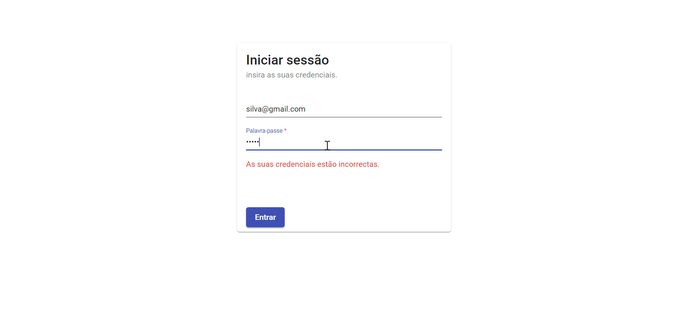
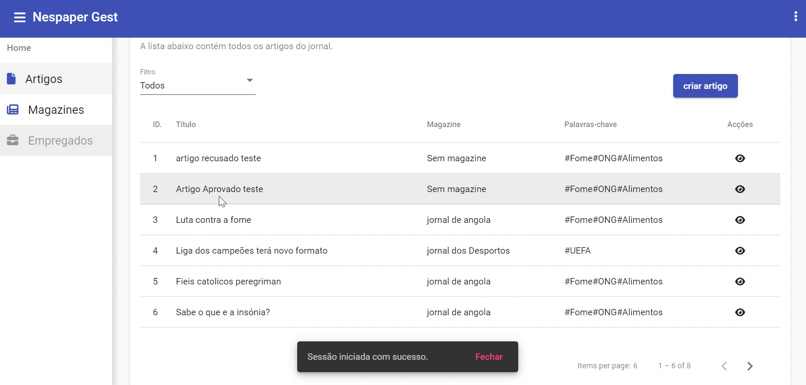
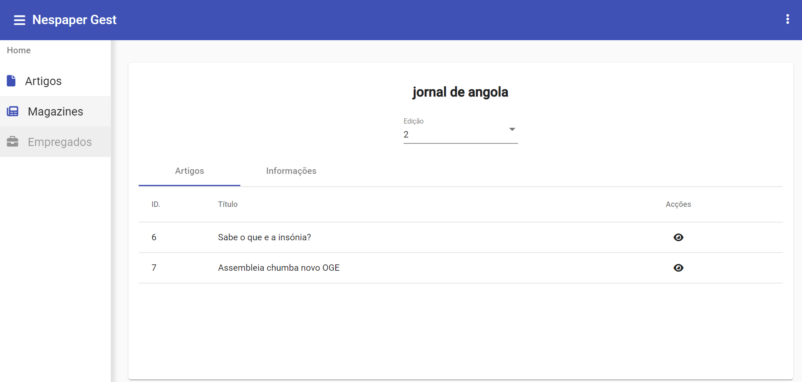

# FullStack App ( Spring + Angular ) : Newspaper Management System 

## Application for articles and magazines management, developed with Java using Spring Framework for backend and Angular along with Material UI Library for frontend development.
Applyng security concepts such as Authorization and Authentication both in Backend and Frontend

###### `The App has the following features:`

1. Creating articles **[Must have Journalist Authoritie]**
2. Avaliate articles for Journalists **[Must have Journalist Authoritie]**
3. view a Article 
4. Add Article to magazine **[Must have administrator Authoritie]** 
5. view a magazine
6. Publish magazines **[Must have Publsher or CEO Authoritie]**
7. view a employees **[Must have administrator Authoritie]**
8. Login access validation using Spring Security
9. Athentication and authorization for users
10. Logout
11. Redirection to login when token expires
12. Responsive design suitable for most devices
13. JWT Token Usage
14. Update token automatically
15. Frontend URL protection
16. Backend unit tests in Controllers, Services and Repositories classes
17. And additional features or functionality in both Backend and Frontend for better user usability

### To Buid Frontend was used:

1. Node js
2. Typescript
3. Angular 13
4. Material UI 13
5. JWT decoder

### To Buid Backend was used:

1. Spring Web
2. Spring Security
3. Spring Data
4. Spring Heteoas
5. Swagger documentation
6. Postgres SQL (DB)
7. TDD(Pattern)
8. DDD(Pattern)

# 	Requirements to run on Localhost

1. **Java Jdk** ( **8/11** )
2. **Spring Tools Suit** | **Eclipse IDE** | **IntelliJ IDEA** | **NetBeans** :  Backend
3. **VScode**:  Frontend
5. **Node Js & npm**
6. **TypeScript**
7. **Angular CLI** 
8. **PgAdmin 4 & PostgreSQL**
9. **Maven**

<h3> Screenshots: <h3>

 
    
    
    
    

